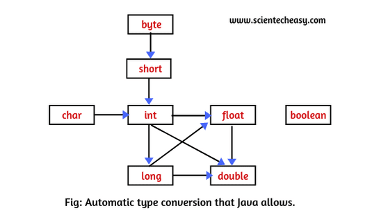

# Operators

- [Operators](#operators-1)
- [Mathematical Functions and Constants](#mathematical-functions-and-constants)
- [Conversions Between Numeric Types](#conversions-between-numeric-types)
- [Casts](#casts)
- [Combining Assignment with Operators](#combining-assignment-with-operators)
- [Increment and Decrement](#increment-and-decrement-operators)
- [Relational and `boolean` Operators](#relational-and-boolean-operators)
- [Bitwise Operators](#bitwise-operators)
- [Parenthesis and Operator Hierarchy](#parentheses-and-operator-hierarchy)
- [Enumerated Types](#enumerated-types)

## Operators

Java uses the the usual operators for addition, subtraction, multiplication, division, and modulus.

- `+`: addition

- `-`: subtraction

- `*`: multiplication

- `/`: division
    - The `/` operator denotes _integer_ division if **both** arguments are integers, and _floating-point_ division otherwise.

- `%`: modulus (Integer remainder)
    - Integer remainder (sometimes called _modulus_) is denoted by `%`.
    - For example, `15 / 2` is `7`, `15 % 2` is `1`, and `15.0 / 2` is `7.5`.

Note that _integer division_ by `0` raises an **exception**, whereas _floating-point division_ by `0` yields an **infinite** or **NaN** result.

- NOTE: One of the stated goals of the java programming language is _portability_. A computation should yield the same results no matter which virtual machine executes it. For arithmetic computations with floating-point numbers, it is surprisingly difficult to achieve this portability. The `double` type uses 64 bits to store a numeric value, but some processors use 80-bit floating-point registers. These registers yield added precision in intermediate steps of a computation. For example, consider the following computation:

```Java
double w = x * y / z;
```

- Many Intel processors compute `x * y`, leave the result in an 80-bit register, then divide by `z`, and finally truncate the results back to 64 bits. That can yield a more accurate result, and it can avoid exponent overflow. But the result may be _different_ from a computation that uses 64 bits throughout. For that reason, the initial specification of the **Java Virtual Machine** mandated that all intermediate computations must be truncated. The numeric community hated it. Not only can the truncated computations cause overflow, they are actually _slower_ than the more precise computations because the truncation operations take time. For that reason, the Java programming language was updated to recognize the conflicting demands for optimum performance and perfect reproducibility. By default, virtual machine designers are now permitted to use extended precision for intermediate computations. However, methods tagged with the `strictfp` keyword must use strict floating-point operations that yield reprodicible results. For example, you can tag `main` as

```Java
public static strictfp void main(String[] args)
```

- Then all instructions inside the `main` method will use strict floating-point computations.

- Theses _gory_ details are very much tied to intel processors. In default mode, intermediate results are allowed to use an extended exponent, not not an extende mantissa. (The Intel chips support truncation of the mantissa without loss of performance.) therefore, the only difference between the default and strict modes is that strict computations may overflow when default computations don't.

- Don't worry though. Floating-point overflow isn't a problem that one ecounters for most common programs. It would be _very rare_ for you to need to use the `strictfp` keyword.

## Mathematical Functions and Constants

The `Math` class contains an assortment of mathematical functions that you may occasionally need, depending on the kind of programming that you do.

To take the square root of a number, use the `sqrt` method:

```Java
double x = 4;
double y = Math.sqrt(x);
System.out.println(y); // prints 2.0
```

- NOTE: There is a subtle difference between the `println` method and the `sqrt` method. The `println` method operates in the `System.out` object. But the `sqrt` method in the `Math` class does not operate on any object. Such a method is called a _static_ method. 

The Java programming language has no operator for raising a quantity to a power: You must use the `pow` method in the `Math` class. The statement

```Java
double y = Math.pow(x, a);
```

sets `y` to be `x` raised to the power `a(x^a)`. The `pow` method's parameters are both of a type `double`, and it returns a `double` as well.

The `floorMod` method aims to solve a long-standing problem with integer remainders. Consider the expression `n % 2`. Everyone knows that this is `0` if `n` is even and `1` if `n` is odd. Except, of course, when `n` is negative. Then it is `-1`. Why? When the first computers were built, someone had to make rules for how integer division and remainder should work for negative operands. Mathematicians had known the optimal (or "Euclidean") rule for a few hundred years: always leave the remainder `>= 0`. But, rather than open a math textbook, those pioneers came up with rules that seemed reasonable but are actually inconvenient.

Consider this problem. You compute the position of the hour hand of a clock. An adjustment is applied, and you want to normalize to a number between `0` and `11`. That is easy: `(position + adjustment) % 12`. But what if the adjustment is negative? Then you might get a negative number. So you have to introduce a branch, or use `((position + adjustment) % 12 +12) % 12. Either way, it is a hassle.

The `floorMod` method makes it easier: `floorMod(position + adjustment, 12)` always yields a value between `0` and `11`. (Unfortunately, `floorMod` gives negative results for negative divisors, but the situation doesn't often occur in practice.)

The `Math` class supplies the usual trigonometric functions:

- `Math.sin`
- `Math.cos`
- `Math.tan`
- `Math.atan`
- `Math.atan2`

and the exponential function with its inverse, the natural logarithm, as well as the decimal logarithm:

- `Math.exp`
- `Math.log`
- `Math.log10`

Finally, two constants denote the closest possible approximations to the mathematical constants &pi; and `e`:

- `Math.PI`
- `Math.E`

TIP: You can avoid the `Math` prefix for mathematical methods and constants by adding the following line at the top of your file:

```Java
import static java.lang.Math.*;
```

For example:

```Java
System.out.println("The square root of \u03C0 is " + sprt(PI));
```

- NOTE: The methods in the `Math` class use the routines in the computer's floating-point unit for fastest performance. If completely predictable results are more important than performance, use the `StrictMath` class instead. It implements the algorithms from the "Freely Distributable Math Library" `fdlibm`, guaranteeing identical results on all platforms. See www.netlib.org/fdlibm for the source of these algorithms. Whenever `fdlibm` provides more than one definition for a function, the `StrictMath` class follows the IEEE 754 version whose name starts with an "e".

## Conversions between Numeric Types

It is often necessary to convert from one numeric type to another. The follwing graph show legal type conversions: 



The following conversions happen without information loss:

- `byte -> short -> int -> long`
- `byte -> short -> int -> double`
- `char -> int -> long`
- `char -> int -> double`
- `float -> double`

Conversions that may lose precision:

- `int -> float`
- `long -> float`
- `long -> double`

For example, a large integer such as `123456789` has more digits than the `float` type can represent. When the integer is converted to a `float`, the resulting value has the correct magnitude but loses precision.

```Java
int n = 123456789;
float f = n; // f is 1.23456792E8
```

When two values are combined with a binary operator (such as `n + f` where `n` is an integer and `f` is a floating-point value), both operands are converted to a common type before the operation is carried out.

- If either of the operands is of type `double`, the other one will be converted to a `double`.

- Otherwise, if either of the operands is of type `float`, the other one will be converted to a `float`.

- Otherwise, if either of the operands is of type `long`, the other one will be converted to a `long`.

- Otherwise, both operands will be converted to an `int`.

## Casts

In the previous section, you saw that `int` values are automatically converted to `double` when necessary. On the other hand, there are obviously times when you want to consider a `double` as an integer. Numeric conversions are possible in Java, but of course information may be lost. Conversions in which loss of information is possible are done by means of _casts_. The syntax for casting is to give the target type in parentheses, followed by the variable name. For example:

```Java
double x = 9.997;
int nx = (int) x;
```

Now, the variable `nx` has a value of `9` because casting a floating-point value to an integer discards the fractional part.

If you want to `round` a floating-point number to the _nearest_ integer (which in most cases is a more useful operation), use the `Math.round` method:

```Java
double x = 9.997;
int nx = (int) Math.round(x);
```

Now the variable `nx` has the value `10`. You still need to use the cast `(int)` when you call `round`. The reason is that the return value of the `round` method is a `long`, and a `long` can only be assigned to an `int` with an explicit cast because there is the possibility of information loss.

- **CAUTION**: If you try to cast a number of one type to another that is out of range for the target type, the result will be a truncated number that has a different value. For example, `(byte) 300` is actually `44`.

## Combining Assignment with Operators

There is a convenient shortcut for using binary operators in an assignment. For example,

```Java
x += 4;
```

is equivalent to 

```Java
x = x + 4;
```

(In general, place the operator to the left of the `=` sign, such as `*=` or `%=`.)

- NOTE: If the operator yields a value whose type is diffent than that of the left hand sidfe, then it is coerced to fit. For Example, if `x` is an `int`, then the statement

```Java
x += 3.5;
```

- is valid, setting `x` to `(int)(x + 3.5)`.

## Increment and Decrement Operators

Programmers, of course, know that one of the most common operations with a numeric variable is to add or subrtract 1. Java, following in the footsteps of C and C++, has both _increment_ and _decrement_ operators: `n++` adds `1` to the current value of the variable `n`, and `n--` subtracts `1` from it. For example, the code

```Java
int n = 12;
n++;
```

changes `n` to `13`. Since these operators change the value of a variable, they cannot be applied to numbers themselves. For example, `4++` is not a legal statement.

There are two forms of these operators; you've just seen the postfix form of the operator that is placed after the operand. There is also a prefix for `n++`. Both change the value of the variable by `1`. The difference between the two appears only when they are used inside expressions. The prefix form does the addition first; the postfix form evaluates to the old value of the variable.

```Java
int m = 7;
int n = 7;

int a = 2 * ++m; // now a is 16, m is 8
int b = 2 * n++; // now b is 14, n is 8
```

It is NOT recommended to use `++` inside expressions because this often leads to confusing code and annoying bugs.

## Relational and boolean Operators

Java has a full complement of relational operators. To test equality, use a double equal sign, `==`. For example, the value of

```Java
3 == 7;
```

is `false`.

Use a `!=` for inequality. For example, the value of 

```Java
3 != 7;
```

is `true`.

Finally, you have the usual `<` (less than), `>` (greater than), `<=` (less than or equal), and `>=` (greater than or equal) operators.

Java, following C++, uses `&&` for the logical "and" operator and `||` for the logical "or" operator. As you can easily remember from the `!=` operator, the exclamation point `!` is the logical negation operator. The `&&` and `||` operators are evaluated in "short circuit" fashion: The second argument is not evaluated if the first argument already determines the value. If you combine two expressions with the `&&` operator, 

```Java
expression1 && expression2
```

and the truth value of the first expression has been determined to be `false`, then it is impossible for the result to be `true`. Thus, the value for the second expression is _not_ calculated. This behavior can be exploited to avoid errors. For example, in the expression

```Java
x != 0 && 1 / x > x + y // no division by 0
```

The second part is never evaluated if `x` equals zero. Thus, `1 / x` is not computed if `x` is zero, and no divide-by-zero error can occur. 

Similarly, the value of `expression1 || expression2` is automatically `true` if the first expression is `true`, without evaluating the second expression.

Finally, Java supports the ternary `?:` operator that is occasionally useful. The expression

```Java
condition ? expression1 : expression2
```

evaluates to the first expression if the condition is `true`, to the second expression otherwise. For example,

```Java
x < y ? x : y
```

gives the smaller of `x` and `y`.

## Bitwise Operators

When working with any of the integer types, you have oeprators that can work directly with the bits that make up integers. This means that you can use masking techniques to get at individual bits in a number. The bitwise operators are

```Java
&("and") | ("or") ^("xor") ~("not")
```

These operators work on bit patterns. For example, if `n` is an integer variable, then 

```Java
int fourthBitFromRight = (n & 0b1000) / 0b1000;
```

gives you a `1` if the fourth bit from the right in the binary representation of `n` is `1`, and `0` otherwise. Using `&` with the appropriate power of `2` lets you mask out all but a single bit.

- NOTE: When applied to `boolean` values, the `&` and `|` operators yield a `boolean` value. These operators are similar to the `&&` and `||` operators, except that the `&` and `|` operators are not evaluated in "short circuit" fashion - that is, both arguments are evaluated before the result is computed.

There are also `>>` and `<<` operators which shift a bit pattern to the right or left. These operators are convenient when you need to build up bit patterns to do bit masking:

```Java
int fourthBitFromRight = (n & (1 << 3)) >> 3;
```

Finally, a `>>>` operator fills the top bits with zero, unlike `>>` which extends the sign bit into the top bits. There is no `<<<` operator.

- **CAUTION**: The right-hand argument of the shift operators is reduced modulo 32 (unless the left-hand argument is a `long`, in which case the right-hand argument is reduced modulo 64). For example, the value of `1 << 35` is the same as `1 << 3` or `8`.

## Parentheses and Operator Hierarchy

The table below shows the precedence of operators. If no parentheses are used, _operations are performed in the hierarchal order_ indicated. Operators in the same level are processed from left to right, except for those that are right-associative, as indicated in the table. For example, `&&` has a higher precedence than `||`, so the expression

```Java
a && b || c
```

means

```Java
(a && b) || c
```

**Operator Precendence**

| Operators                  | Associativity   |
| ---                        | ---             |
| `[] . () (method call)`    | Left to Right   |
| `! ~ ++ -- + (unary) - (unary) () (cast) new`| Right to Left |
| `* / %`                    | Left to Right   |
| `+ -`                      | Left to Right   |
| `<< >> >>>`                | Left to Right   |
| `< <= > >= instanceof`     | Left to Right   |
| `== !=`                    | Left to Right   |
| `&`                        | Left to Right   |
| `^`                        | Left to Right   |
| `'or' operator (one vertical bar)`                        | Left to Right   |
| `&&`                       | Left to Right   |
| `'or' operator (double vertical bar)`| Left to Right   |
| `?:`                       | Right to Left   |
| `= += -= *= /= %= &= (verticalBar 'or')= ^= <<= >>= >>>=` | Right to Left  |

Since `+=` associates right to left, the expression

```Java
a += b += c
```

means

```Java
a += (b += c)
```

That is, the value of `b += c` (which is the value of `b` after the addition) is added to `a`.

## Enumerated Types

Sometimes, a variable should only hold a restricted set of values. For example, you may sell clothes or pizza in four sizes: small, medium, large, and extra large. Of course, you could encode these sizes as integers `1`, `2`, `3`, `4` or characters `S`, `M`, `L`, and `X`. But that is an error-prone setup. It is too easy for a variable to hold a wrong value (such as `0` or `m`).

You can define your own _enumerated type_ whenever such a situation arises. An enumerated type has a finite number of named values. For example:

```Java
enum Size { SMALL, MEDIUM, LARGE, EXTRA_LARGE };
```

Now you can declare variables of this type:

```Java
Size s = Size.MEDIUM;
```

A variable of type `Size` can hold only one of the values listed in the type declaration, or the special value `null` that indicates that the variable is not set to any value at all.