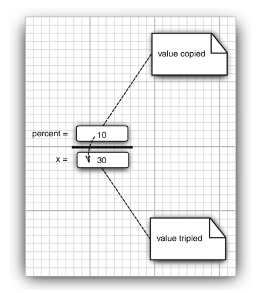
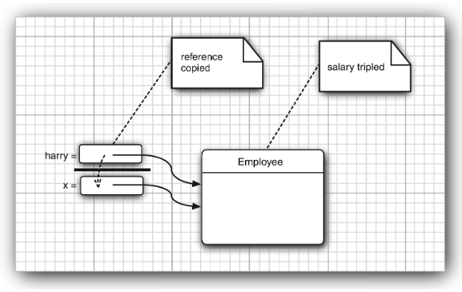
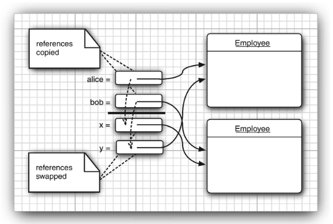

# Method Parameters

Let us review the computer science terms that describe how parameters can be passed to a method (or a function) in a programming language. The term _call by value_ means that the method gets the _location_ of the variable that the caller provides. Thus, a method can _modify_ the value stored in a variable passed by reference but not in one passed by value. These "call by ..." terms are standard computer science terminology describing the behavior of method parameters iin various programming languages, not just Java. (There is also a _call by name_ that is mainly of historical interest, being employed in the Algol programming language, one of the oldest high-level languages.)

The Java programming language _always_ uses call by value. That means that the method gets a copy of all parameter values. In particular, the method cannot modify the contents of any parameter variables passed to it.

For example, consider the following call:

```Java
double percent = 10;
harry.raiseSalary(percent);
```

No matter how the method is implemented, we know that after the method call, the value of `percent` is still `10`.

Let us look a little more closely at this situation. Suppose a method tried to triple the value of a method parameter:

```Java 
public static void tripleValue(double x) { // doesn't work
    x = 3 * x;
}
```

Let's call this method:

```Java
double percent = 10;
tripleValue(percent);
```

However, this does not work. After the method call, the value of `percent` is still `10`. Here is what happens:

1. `x` is initialized with a copy of the value of `percent` (that is, `10`).

2. `x` is tripled - it is now `30`. But `percent` is still `10`.

3. the method ends, and the parameter variable `x` is no longer in use.

There are, however, two kinds of method parameters:

- Primitive types (numbers, `boolean` values)

- Object references



- **Figure 4.6**: Modifying a numeric parameter has no lasting effect.

You have seen that it is impossible for a method to change a primitve for a method to change a primitve type parameter. The situation is different for object parameters. You can easily implment a method that triples the salary of an employee:

```Java
public static void tripleSalary(Employee x) { // works
    x.raiseSalary(200);
}
```

When you call

```Java
harry = new Employee(...);
tripleSalary(harry);
```

then the following happens:

1. `x` is initialized with a copy of the value of `harry`, that is, an object reference.

2. The `raiseSalary` method is applied to that object reference. The `Employee` object to which both `x` and `harry` refer gets its salary by 200 percent.

3. The method ends, and the parameter variable `x` is no longer in use. Of course, the object variable `harry` continues to refer to the object whose salary was tripled (see Figure 4.7).



- **Figure 4.7**: Modifying an object parameter has a lasting effect.

As you have seen, it is easily possible - and in fact very common - to implement methods that change the state of an object parameter. The reason is simple. The method gets a copy of the object reference, and both the original and the copy refer to the same object.

Many programming languages (in particular, C++ and Pascal) have two mechanisms for parameter passing: call by value and call by reference. Some programmers (and unfortunately even some book authors) claim that Java uses call by reference for objects. That is false. As this is such a common misunderstanding, it is worth examining a counterexample in detail.

Let's try to write a method that swaps two employee objects:

```Java
public static void swap(Employee x, Employee y) { // doesn't work
    Employee temp = x;
    x = y;
    y = temp;
}
```

If Java used call by reference for objects, this method would work:

```Java
Employee a = new Employee("Alice", ...);
Employee b = new Employee("Bob", ...);
swap(a, b);
// does a now refer to Bob, b to Alice?
```

However, the method does not actually change the object references that are stored in the variables `a` and `b`. The `x` and `y` parameters of the `swap` method are initialized with _copies_ of these references. The method then proceeds to swap these copies.

```Java
// x refers to Alice, y to Bob
Employee temp = x;
x = y;
y = temp;
// now x refers to Bob, y to Alice
```

But ultimately, this is a wasted effort. Then the method ends, the parameter variables `x` and `y` are abandoned. The original variables `a` and `b` still refer to the same objects as they did before the method call (see Figure 4.8).



- **Figure 4.8**: Swapping object parameters has no lasting effect.

This demonstrates that the Java programming language does not use call by reference for objects. Instead, _object references are passed by value_.

