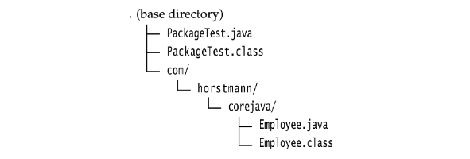
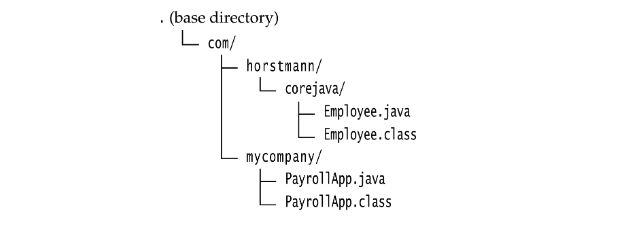

# Packages

- [Class Importation](#class-importation)
- [Static Imports](#static-imports)
- [Addition of a Class into a Package](#addition-of-a-class-into-a-package)
- [Package Scope](#package-scope)

Java allows you to group classes in a collection called a _package_. Packages are convenient for organizing your work and for separating your work from code libraries provided by others.

The standard Java library is distributed over a number of packages, including `java.lang`, `java.util`, `java.net`, and so on. The standard Java packages are examples of hierarchal packages by using levels of nesting. All standard Java packages are inside the `java` and `javax` package hierarchies.

The main reason for using packages is to guarantee the uniqueness of class names. Suppose two programmers come up with the bright idea of supplying an `Employee` class. As long as both of them place their class into different packages, there is no conflict. In fact, to absolutely a unique package name, use an Internet domain name (which is known to be unique) written in reverse. You then use subpackages for different projects. For example, consider the domain `horstmann.com`. When written in reverse order, it turns into the package `com.horstmann`. That package can then be further subdivided into subpackages such as `com.horstmann.corejava`.

From the point of view of the compiler, there is absolutely no relationship between nested packages. For example, the packages `java.util` and `java.util.jar` have nothing to do with each other. Each is its own independent collection of classes.

## Class Importation

A class can use all classes from its own package and all _public_ classes from other packages.

You can access the public classes in another package in two ways. The first is simply to add the full package name in front of _every_ class name. For example:

```Java
java.time.LocalDate today = java.time.LocalDate.now();
```

That is obviously tedious. A simpler, and more common, approach is to use the `import` statement. The point of the `import` statement is to give you a shorthand to refer to the classes in the package. Once you use `import`, you no longer have to give the classes their full names.

You can import a specific class or the whole package. You place `import` statements at the top of your source files (but below and `package` statements). For example, you can import all classes in the `java.util` package with the statement

```Java
import java.util.*;
```

Then you use

```Java
LocalDate today = LocalDate.now();
```

The `java.time.*` syntax is less tedious. It has no negative effect on code size. However, if you import classes explicitly, the reader of your code knows exactly which classes you use.

- **Tip**: In Eclipse, you can select the menu option Source -> Organize Imprts. Package statements such as `import java.util.*;` are automatically expanded into a list of specific imports such as 

    ```Java
    import java.util.ArrayList;
    import java.util.Date;
    ```

    This is an extremely convenient feature.

However, not that you can only use the `*` notation to import a single package. You cannot use `import java.*` or `import java .*.*` to import all packages with the `java` prefix.

Most of the time, you just import the packages that you need, without worrying too much about them. The only time that you need to pay attention to packages is when you have a name conflict. For example, both the `java.util` and `java.sql` packages have a `Date` class. Suppose you write a program that imports both packages.

```Java
import java.util.*;
import java.sql.*;
```

If you want to use the `Date` class, you get a compile-time error:

```Java
Date today; // Error--java.util.Date or java.sql.Date?
```

The compiler cannot figure out which `Date` class you want. You can solve this problem by adding a specific `import` statement:

```Java
import java.util.*;
import java.sql.*;
import java.util.Date;
```

What if you really need both `Date` classes? Then you need to use the full package with every class name.

```Java
java.util.Date deadline = new java.util.Date();
java.sql.Date today = new java.sql.Date(...);
```

Locating classes in packages is an activity of the _compiler_. The bytecodes in class files always use full package names to refer to other classes.

## Static Imports

A form of the `import` statement permits the importing of static methods and fields, not just classes.

For example, if you add the directive

```Java
import static java.lang.System.*;
```

to the top of your source file, then you can use the static methods and fields of the `System` class without the class name prefix:

```Java
out.println("Goodbye, World!"); // i.e., System.out
exit(0); // i.e., System.exit
```

In practice, it seems doubtful that many programmers will want to abbreviate `System.out` or `System.exit`. The resulting code seems less clear. On the other hand,

```Java
sqrt(pow(x, 2) + Math.pow(y, 2))
```

## Addition of a Class into a Package

To place classes inside a package, you must put the name of the package at the top of your source file, _before_ the code that defines the classes in the package. For example, the file `Employee.java` in [Listing 4.7]() start out liek this:

```Java
package com.horstmann.corejava;

public class Employee {
    ...
}
```

If you don't put a `package` statement in the source file, then the classes in that source file belong to the _default package_. The default package has no package name. Up to now, all our example classes were located in the default package. 

Place source files into a subdirectory that matches the full package name. For example, all source files in the `com.horstmann.corejava` package should be in a subdirectory `com/horstmann/corejava` (`com\horstmann\corejava` on Windows). The compiler places the class files into the same directory structure.

The program in [Listng 4.6](#listing-46) and [4.7](#listing-47) is distributed over two packages: The `PackageTest` class belongs to the default package, and the `Employee` class belongs to the `com.horstmann.corejava` package. Therefore, the `Employee.java` file must be in a subdirectory `com/horstmann/corejava`. In other words, the directory structure is as follows:



To compile this program, simply change to the base directory and run the command

```Java
javac PackageTest.java
```

The compiler automatically finds the file `com/horstmann/corejava/Employee.java` and compiles it.

Let's look at a more realistic example, in which we don't use the default package but have classes distributed over several packages (`com.horstmann.corejava` and `com.mycompany`).



In this situation, you must compile and run classes from the _base_ directory:

```Java
javac com/mycompany/PayrollApp.java
java com.mycompany.PayrollApp
```

Note again that the compiler operates on _files_ (with file separators and an extension `.java`) , whereas the Java interpretor loads a _class_ (with dot separators).

- **Tips**: Starting with the next chapter, we will use packages for the cource code. That way. you can make an IDE project for each chapter instead of each section.

- **CAUTION**: The compiler does _not_ check the directory structure when it compiles source files. For example, suppose you have a source file that starts with the directive

    ```Java
    package com.mycompany;
    ```
    You can compile the file even if it is not contained in a subdirectory `com/mycompany`. The source file will compile without errors _if it doesn't depend on other packages_. However, the resulting program will not run unless you first move all class files to the right place. The _virtual machine_ won't find the classes if the packages don't match the directories.

### Listing 4.6

- `PackageTest/PackageTest.java`

```Java
import com.horstmann.corejava.*;
// the Employee class is defined in that package

import static java.lang.System.*;

/**
 * This program demonstrates the use of packages.
 * @version 1.11 2004-02-19
 * @author Cay Horstmann
 **/
public class PackageTest {

    public static void main(String[] args) {

        // because of the import statement, we don't have to use
        // com.horstmann.corejava.Employee here
        Employee harry = new Employee("Harry Hacker", 50000, 1989, 10, 1);

        harry.raiseSalary(5);

        // because of the static import statement, we don't have to use System.out here
        out.println("name=" + harry.getName() + ",salary=" + harry.getSalary());
    }
}
```

### Listing 4.7

- `PackageTest/com/horstmann/corejava/Employee.java`

```Java
package com.horstmann.corejava;

// the classes in this file are part of this package

import java.time.*;

// import statements come after the package statement

/**
 * @version 1.11 2015-05-08
 * @author Cay Horstmann
 **/
public class Employee {

    private String name;
    private double salary;
    private LocalDate hireDay;

    public Employee(String name, double salary, int year, int month, int day) {
        this.name = name;
        this.salary = salary;
        hireDay = LocalDate.of(year, month, day);
    }

    public String getName() {
        return name;
    }

    public double getSalary() {
        return salary;
    }

    public LocalDate() {
        return hireDay;
    }

    public void raiseSalary(double byPercent) {
        double raise = salary * byPercent / 100;
        salary += raise;
    }
}
```

## Package Scope